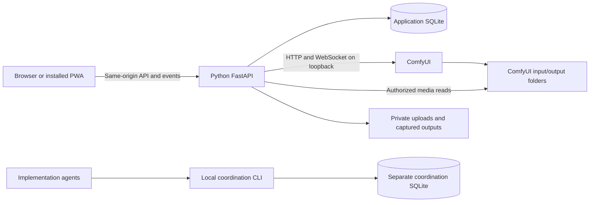

# Product and architecture

## Scope and assumptions

The first release is a personal/home service. Python and ComfyUI run on the same machine, with explicit filesystem paths supplied during setup. Browsers and installed PWAs may run on other devices on the home network. ComfyUI remains responsible for model loading, GPU execution, and its execution queue.

Users import ComfyUI API JSON and receive grouped generation controls automatically. A mapping editor resolves uncertain labels, groups, widget choices, and exposure. No node canvas, regular workflow JSON importer, automatic model installation, public registration, administrator role, native Android build, or distributed backend is planned initially.

Image and video generation are first-release requirements. Compatibility is metadata-driven rather than a whitelist of model families. Custom nodes that require special frontend behavior may need an explicit adapter; the UI must state this without pretending to support them.

Design defaults selected where the conversation left behavior open:

- Profiles have passwords in multi-user mode; a profile picker alone does not provide privacy.
- All accounts have equal application permissions and manage their own data.
- Machine-wide controls are available through local setup/settings, not arbitrary LAN sessions. This is a host configuration boundary, not an administrator account.
- Disabling multi-user mode while additional profiles exist is blocked; it must not expose their data through the default session.
- Existing outputs are indexed in place under Default. Newly discovered files with uncertain ownership are withheld from galleries until resolved locally.
- Original ComfyUI files are not deleted by ordinary gallery removal. Permanent file deletion and automatic transcoding are deferred.

## Svelte versus SvelteKit

Svelte is the component framework used in both options. The practical comparison is Svelte with Vite and separately chosen navigation versus SvelteKit's application conventions. [SvelteKit introduction](https://svelte.dev/docs/kit/introduction)

| Consideration | Svelte + Vite | SvelteKit, static SPA |
| --- | --- | --- |
| Advantages | Small conceptual footprint; direct fit for one screen; Python remains the obvious server | Built-in routing and layouts; consistent screen structure; useful for Generate, Gallery, History, Workflows, Settings, and Login |
| Costs | Must choose or implement navigation, route loading/error conventions, and deep-link behavior | More conventions; must keep server-only features out of a static deployment |
| Python integration | Serve compiled static assets and route API calls to Python | Same production arrangement, with a generated SPA fallback page |
| SSR | Separate integration if later needed | Available with a different deployment model, but deliberately unused here |
| Mobile installation | Manifest and appropriate hosting needed | Same; using Kit alone does not make an app installable |
| Best fit | A mostly single-screen tool | This app's several related screens and persistent navigation |

Recommendation: **SvelteKit with adapter-static**, client rendering, TypeScript, and Svelte 5. This avoids selecting a separate router while retaining Python as the only production application server. No SvelteKit server routes, form actions, or second authentication layer. Node is a build/development dependency only. Python serves the SPA fallback for browser navigation, never for unknown API or asset requests. SPA startup requires JavaScript and extra requests; this is an acceptable tradeoff for this home-network application. [SPA deployment](https://svelte.dev/docs/kit/single-page-apps), [static adapter](https://svelte.dev/docs/kit/adapter-static)

## Runtime boundary

Use FastAPI for validated HTTP contracts and API documentation. Prefer Python's sqlite3 with explicit migrations and short operations in a thread worker; keep filesystem scans, database work, and thumbnail work off the async event loop. Use one reusable async HTTP/WebSocket client, such as aiohttp, for ComfyUI. Pin supported dependency versions during implementation. [FastAPI](https://fastapi.tiangolo.com/)

One backend process owns catalog refresh, reconciliation, and media indexing. No Redis, Celery, worker service, or ORM is needed for the initial deployment. Persist work before side effects so process restarts can recover. A second backend worker would require explicit ownership of background jobs and is outside this release.

Proposed directories, created during implementation:

| Path | Responsibility |
| --- | --- |
| frontend/ | SvelteKit UI, build, manifest, and shell caching |
| backend/app/ | API, profiles, catalog, mapping, generations, media, storage |
| backend/tests/ | Contract, privacy, persistence, and mapping checks |
| tests/fixtures/ | Sanitized API graphs, metadata, event and output fixtures |
| tools/agent_coord.py | Agent coordination CLI |
| .coord/ | Ignored local coordination database and exports |
| data/ | Ignored application database, private uploads, captures, thumbnails |
| docs/ | Design, compatibility record, deployment, and task specifications |

Keep configuration for the ComfyUI URL, input/output/temp roots, private data root, HTTPS, and secrets server-side. Default ComfyUI connection: loopback port 8188, configurable locally. No browser-provided upstream URL or arbitrary proxy route. Standard local ComfyUI does not require inventing cloud API credentials; optional upstream credentials, if configured, stay in Python and outside workflow/history exports.

## API and execution contract

The baseline integration uses object_info for discovery, prompt for submission, ws for execution updates, queue for reconciliation, and history for completed results. Image/mask upload routes exist; do not assume a universal video-upload route. [ComfyUI routes](https://docs.comfy.org/development/comfyui-server/comms_routes)

Proposed application API groups:

| Group | Operations |
| --- | --- |
| /api/session, /api/profiles | Current session, login/logout, local profile creation, own password changes |
| /api/settings | Effective settings and permitted preference changes; host settings have a separate local gate |
| /api/catalog | Cached normalized metadata, catalog revision, explicit refresh with cooldown |
| /api/workflows | Import, list, inspect controls, save mapping, rename, archive, export own API JSON |
| /api/generations | Submit, list, inspect, cancel when safely supported, reuse as a new draft |
| /api/events | Authenticated WebSocket with normalized, profile-filtered updates |
| /api/media | Paginated gallery, item detail, stream, thumbnail, download, hide/favorite |
| /api/uploads | Bounded upload and opaque profile-owned input ID |

Freeze detailed request/response schemas before parallel feature work. Include structured errors, request IDs, pagination cursors, revisions for conflicting edits, and string-encoded large integer controls. Owner identity always comes from the session, never a request's profile_id.

Submission sequence:

1. Authenticate; atomically reserve a profile-scoped client request key and compare its canonical request fingerprint before resolving seeds or performing side effects. An identical retry returns the existing generation; a changed payload conflicts. For a new request, validate workflow ownership, mapping revision, catalog compatibility, and referenced uploads.
2. Build a copy of the stored graph using only approved literal bindings. Resolve random/increment seed policies and persist the exact submitted values.
3. Persist a generation ID, owner, workflow/mapping revision, sanitized input snapshot, and client request key before contacting ComfyUI. Repeating a request key with the same payload returns the same local generation; changed payload conflicts.
4. Send once and record the upstream prompt ID. Keep a correlation marker in supported extra_data without relying on it for authorization.
5. Normalize progress/errors and reconcile with queue/history on reconnect or restart. Forward only owned execution data; drop previews whose owner cannot be proven.
6. Register outputs against the persisted owner. Completion with no saved media is valid and shown explicitly.

Suggested states: submitting, submission_unknown, queued, running, succeeded, failed, cancelled, interrupted, unknown. Lost submit responses enter submission_unknown: query for correlation evidence and never automatically resubmit an uncertain side effect. Even when a newer ComfyUI accepts a supplied prompt ID, validate its duplicate behavior rather than assuming idempotency.

Track execution status separately from output availability (pending, ready, partial, unavailable). ComfyUI can accept valid output branches while reporting errors for others; a successful submission response is not proof that the whole workflow will execute. Persist returned node_errors and affected outputs even when a prompt ID is returned. Show partial results and validation warnings explicitly. Node completion events are not whole-job completion; reconcile terminal execution with history, including cached nodes that emit no fresh execution event. [Execution and validation implementation](https://raw.githubusercontent.com/Comfy-Org/ComfyUI/master/execution.py)

Event delivery is advisory: reconnect fetches the current owned generation snapshot rather than depending on replay of every WebSocket frame. Throttle previews and bound subscriber queues; a slow phone must not stall reconciliation. Retain generation success if later indexing or capture fails, but display the output error and allow ingestion retry without rerunning the workflow.

Cancellation must target an owned prompt. Current upstream source includes a per-job cancellation route; older installations may lack it. Probe capability and test its behavior. Do not fall back to a global interrupt based on a stale queue check: it can stop another job. Disable unsafe running cancellation and explain the unavailable capability. Never expose global queue/history clearing. [ComfyUI server implementation](https://raw.githubusercontent.com/Comfy-Org/ComfyUI/master/server.py)

The backend queue does not replace ComfyUI's queue. Apply bounded per-profile submissions and a global pending cap; surface busy state without exposing other users' prompts. Browser disconnects do not cancel work.

## Profiles and privacy

First launch creates Default and uses it automatically in single-user mode. Before enabling multi-user mode, complete a baseline media scan, assign a password to Default, and invalidate existing anonymous sessions. Every profile then authenticates separately. Creation occurs from locally gated settings; there is no administrator role or public signup. Password recovery is an explicit local-host operation documented for later implementation, never a remote bypass.

Use a maintained password-hashing library with Argon2id, random opaque server-side sessions stored as token hashes, HttpOnly/SameSite cookies, Secure cookies over HTTPS, login throttling, session expiry, and CSRF/origin checks for mutations and WebSockets. The loopback development exception must not become a LAN authentication bypass. Local settings gates must reject untrusted Host/Origin values and ignore untrusted forwarded headers. A reverse proxy requires an explicit trusted configuration; request.is_loopback alone is insufficient behind a proxy.

Bind data ownership at submission, not at completion or according to whichever browser profile is currently active. Every workflow, mapping, generation, input, media item, thumbnail, prompt search result, and event is owner-filtered. Profile switching clears in-memory sensitive state and terminates old subscriptions. Another profile's IDs return no content, including through range and conditional requests.

Raw catalog snapshots stay server-side: custom node options can contain shared input filenames or paths. The catalog API returns a sanitized schema projection, replacing file choices with owned input references for supported loaders and withholding unclassified path-bearing choices. Workflow exports, node diagnostics, and upstream errors follow the same rule; authenticated access alone does not make a global raw response private.

Privacy here means isolation through this application. ComfyUI and installed custom nodes run with the host's filesystem privileges. They are not sandboxed by this UI. Arbitrary imported graphs may read files through custom nodes. All users must therefore be trusted home users; isolate ComfyUI execution per user if hostile-user isolation becomes a requirement. Keep ComfyUI on loopback and do not publish its raw media/API routes alongside the app. Settings and UI hiding cannot make arbitrary custom nodes safe for untrusted tenants.

## Gallery and filesystem ownership

Build a durable filesystem index rather than relying on execution history as an exhaustive archive. First setup scans configured output roots and assigns existing stable files to Default. Import timestamps and metadata only where available; missing prompt or workflow data remains unknown. Do not fabricate full history for old images or videos.

Finish this one-time baseline before accepting app submissions. Store its root identity and completion marker durably; an interrupted scan resumes with the same import boundary. Changing roots later uses an explicit local import operation, never silently repeats first-run ownership assignment. Enabling multi-user mode also waits for unresolved single-user submissions to be reconciled and atomically closes admission during the session-mode change.

After baseline:

- Known generation results are attached to their recorded owner before general discovery can expose them.
- For supported save nodes, assign a unique per-generation output prefix and record it before submission. User labels remain a suffix, never an arbitrary directory.
- For nodes without controllable paths, use explicit result descriptors and capture a stable copy in the private application store. Unknown formats or unprovable associations become an unresolved-output state.
- Unattributed files discovered after baseline remain outside user galleries until local resolution. They may be genuine external ComfyUI outputs or late results of an app submission; file timestamps alone cannot establish ownership.
- Files in reserved application output namespaces are never automatically imported into Default. Restart reconciliation runs before resolving unclaimed media.
- Do not silently reassign reused filenames. Track canonical path plus file identity/version evidence; changed content invalidates old indexed references. App-owned captures use unique immutable paths.

Register result ingestion idempotently by generation, output node, descriptor ordinal, and file version. Replayed history must not duplicate cards. A cached result referencing an existing file must pass ownership/provenance checks before linking or copying; an output descriptor alone does not transfer another profile's file. Preview-only/temp results are labeled ephemeral and require a verified private capture to become saved gallery items. Low disk space or an incomplete write leaves capture pending/failed without discarding the execution record.

Index in batches, wait for stable size/mtime before ingesting, and support a debounced rescan. Avoid reading entire videos merely to discover them. Old files remain in place; new outputs may be captured once to avoid later overwrites. Missing files remain marked unavailable in history.

Stream through authenticated opaque media IDs with MIME handling, Content-Length, HEAD, and byte ranges for video seeking. Use a tested file-response implementation. Never accept an arbitrary path from the browser. Resolve paths against configured roots, accounting for Windows case behavior, drive changes, traversal, symlinks, and junctions; reject escapes. Do not expose output folders as static mounts.

Media adapters normalize image batches and supported video result descriptors. Current built-in video nodes produce saved video descriptors; custom packs may differ. Inspect actual fixture output rather than assuming every result is under an images key. Preserve downloadable originals; browser-incompatible codecs display a clear playback limitation. [Built-in video nodes](https://raw.githubusercontent.com/Comfy-Org/ComfyUI/master/comfy_extras/nodes_video.py)

Use image thumbnails and video posters when a supported decoder is available; otherwise use a media placeholder. FFmpeg is optional for posters, not a silent generation prerequisite. No video autoplay by default. Gallery supports image/video filters, workflow/date filters, favorites, prompt search where known, lightbox/player, download, and reuse of recorded generation inputs.

Uploads are stored privately with opaque IDs, then staged to a supported loader path under the configured input root. Do not expose global ComfyUI input filenames as a cross-profile dropdown. Reference images, uploaded masks, and video files are planned; drawing a mask editor is deferred. Upload adapters must establish the loader's actual filename contract. Stream bounded files; enforce type/size policy without loading videos wholly into memory.

## Persistence

Application SQLite stores metadata; media remains on disk. Use foreign keys, indexed owner/time queries, migrations, and transaction boundaries around related changes.

| Records | Required content |
| --- | --- |
| profiles, sessions | Stable identity, password hash, hashed sessions, expiry |
| settings | Host configuration references and profile preferences, with schema version |
| catalogs | Raw and normalized metadata, content hash, fetched time, freshness/error state |
| workflows, workflow_revisions | Owner, immutable imported graph and later revisions |
| mapping_overrides | Owner, scope, binding selector, schema signature, presentation settings |
| generations | Owner, exact submitted graph, effective values/seeds, upstream ID, state/times/error |
| uploads, media | Owner, generation link when known, storage locator, media type, integrity/version state |
| scan_state | Baseline completion, configured root identity, rescan cursor, unresolved files |

Use generation snapshots as prompt history rather than copying prompts into a second divergent store. Search stored inputs and recorded prompt bindings. The history toggle controls long-term retention: a minimal execution snapshot still persists while a job is submitting, uncertain, or active so recovery works. With history disabled, purge its prompt/graph snapshot after terminal reconciliation and media association; preserve owner, request fingerprint, upstream ID, status, and media provenance. Clearly disclose this temporary retention. Clearing history never deletes an active recovery record; mark it for purge when reconciled. ComfyUI may retain its own metadata independently, and imported workflow documents remain until separately removed.

Keep staged inputs while referenced by active/uncertain jobs or retained workflows/history. Clean abandoned uploads and failed captures only after a grace period and reference check. Reuse validates that referenced inputs still exist, otherwise requests a replacement. Do not promise exact regeneration when models, custom nodes, or source files have changed.

Database backup must use SQLite's backup facility or a stopped/checkpointed store, with a manifest for private files. Do not copy only a live .db file and ignore its WAL. Restore must preserve IDs and ownership. Application and coordination databases have independent backups and migrations. [Python sqlite3 facilities](https://docs.python.org/3/library/sqlite3.html)

## UI and settings

Generate opens with a workflow selector, positive/negative text where confidently known, compact basic controls, collapsed advanced groups, a persistent Generate action, and latest result. Show unresolved mappings next to the workflow name. Never require a mapping wizard for a graph whose literals already produce safe controls.

Desktop: control pane and large result pane. Tablet: narrower controls with collapsible groups. Phone: single column, Generate/Gallery/History/Settings navigation, safe-area-aware action bar, collapsible results. Test at 360, 768, and 1440 CSS pixels, landscape, zoom, and on-screen keyboard. No horizontal page scrolling. Use labeled native controls, keyboard navigation, visible focus, reduced motion, and touch targets of roughly 44 CSS pixels. Compact means reduced empty space, not tiny tap targets.

| Settings scope | Initial controls |
| --- | --- |
| Local host | ComfyUI connection and folders; multi-user/profile creation; upload limits; pending cap; catalog refresh minimum; media rescan; backup location |
| Per profile: appearance | System/light/dark theme; comfortable/compact density; advanced controls; group collapse preferences |
| Per profile: generation | Seed policy; live previews; image/video feature visibility; completion sound off by default |
| Per profile: gallery | Thumbnail size; autoplay off; default filters; page size |
| Per profile: history | Store future prompt/workflow snapshots; clear own history with explicit consequences |
| Read-only diagnostics | Connection, catalog freshness, storage availability, unsupported capabilities, version report |

Feature visibility does not alter graph topology. Disabling video hides its UI entry points and blocks new video submissions when classifiable; it does not delete prior outputs or interrupt work. Hiding advanced inputs preserves their values. Privacy enforcement, ownership checks, and traversal protection are never optional settings.

## PWA delivery

Provide a manifest, application icons, standalone display, and a narrowly scoped service worker caching only versioned public shell assets. API responses, uploads, thumbnails, and generated media use private/no-store behavior and bypass service-worker caches. Offline mode shows a connection message; it never queues a generation for later submission. Reconnect restores owned jobs from the backend.

Android devices connect to the home computer. For installation, serve through trusted HTTPS on the LAN; localhost exemptions on the PC do not apply to a phone visiting the PC's LAN IP. Document certificate trust and installation verification on Android Chrome. Native APK, Play Store distribution, push notifications, and offline generation are deferred. [PWA installation requirements](https://developer.mozilla.org/en-US/docs/Web/Progressive_web_apps/Guides/Making_PWAs_installable)

## Release evidence

Require one actual image workflow and one actual video workflow on a recorded ComfyUI installation. Also exercise two authenticated profiles, gallery imports, upload ownership, reconnect/restart, unavailable ComfyUI, and Android installation over trusted HTTPS. Fixture tests alone cannot claim GPU compatibility. Record any missing model/GPU/browser prerequisite as an explicit release blocker rather than silently dropping image or video support.

Include regressions for an accepted prompt with a rejected output branch, a fully cached run, duplicate completion/history delivery, disk-full capture failure, a mode switch during submission, sanitized catalog choices, and history-disabled restart recovery. These extend the existing CATALOG-001, AUTH-001, MEDIA-001, GEN-001, UI-003, and VERIFY-001 acceptance scope; no new service or release phase is required.
